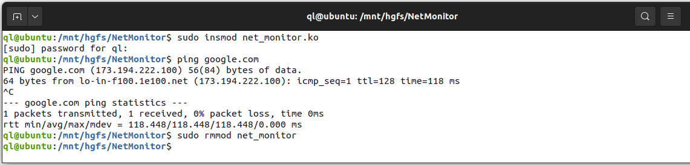
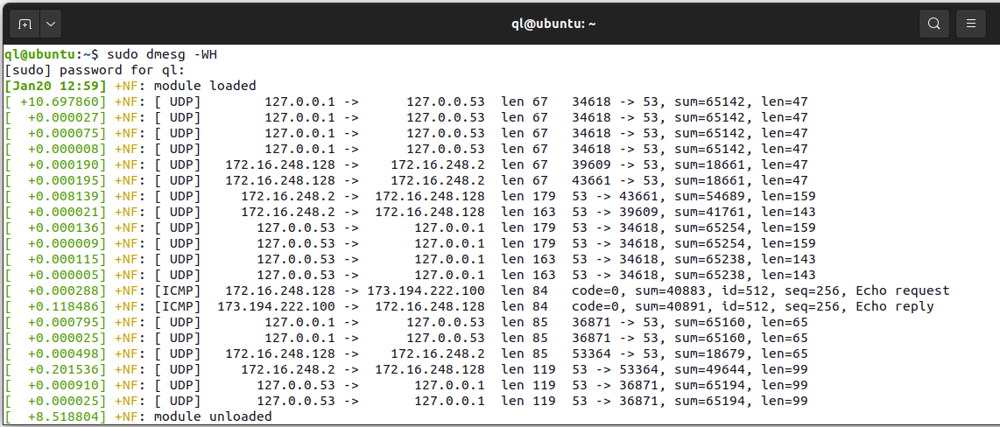
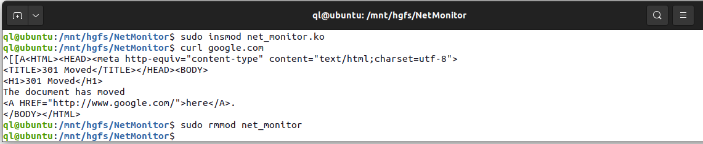
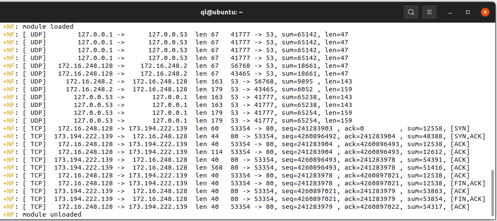
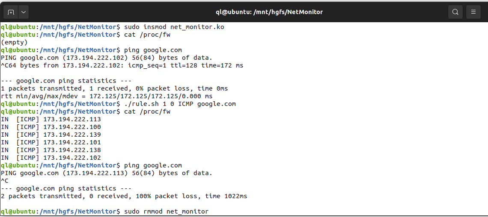
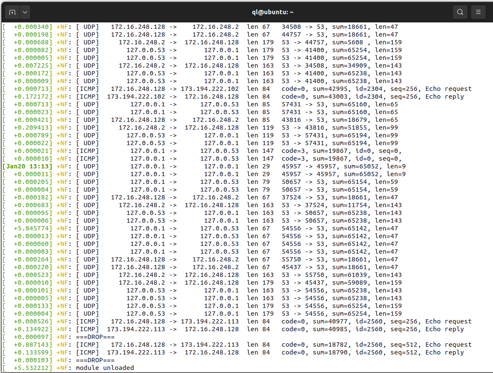
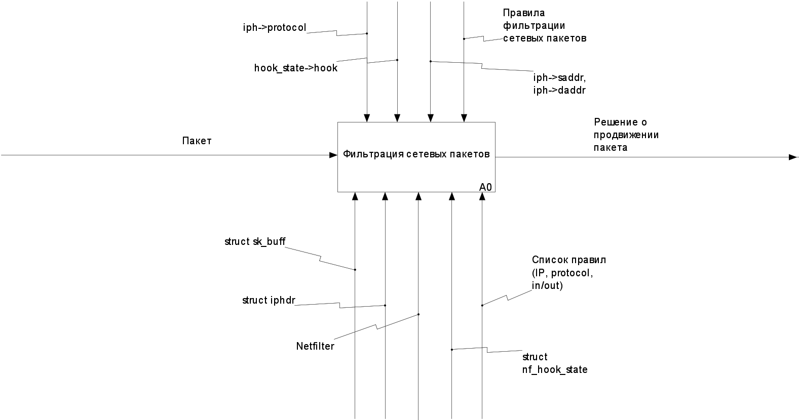
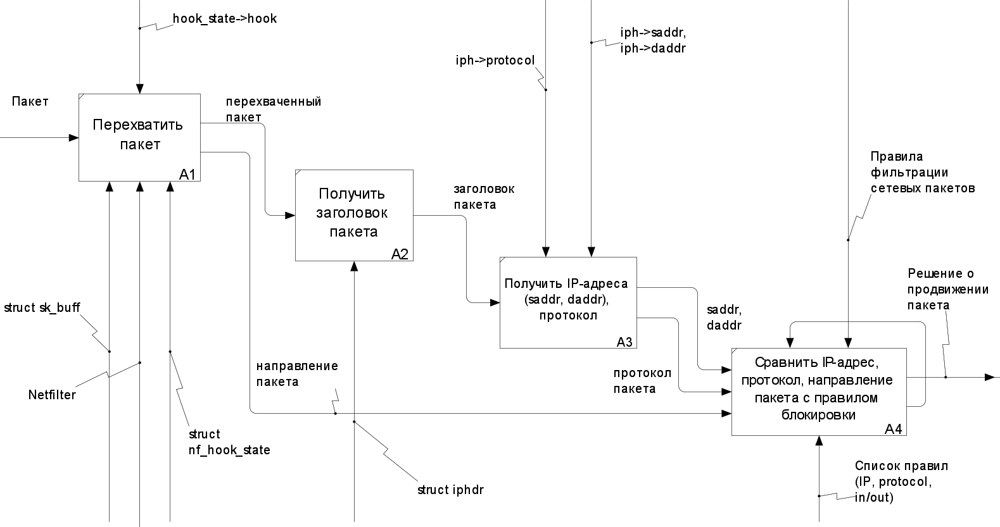

# packet-filter

### Использование утилиты ping для проверки корректности работы программы при обработке пакетов протокола ICMP

### Использование утилиты curl для проверки правильности работы программы при обработке пакетов протокола TCP

### Использование вспомогательного скрипта добавить правила в список правил, с помощью виртуальной файловой системы /proc; использование утилиту ping для проверки правильно ли отбрасываются пакеты

## IDEF0

